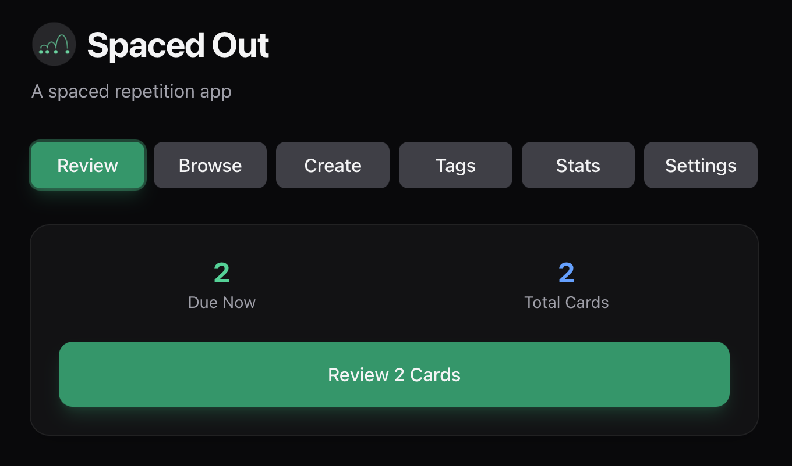

# Spaced Out

A spaced repetition app built with Rust and Tauri.

Main Screen



Browse Cards


## Tech Stack

- **Backend**: Rust (Tauri 2.0)
- **Frontend**: Vanilla JavaScript, HTML, CSS
- **Database**: SQLite (rusqlite)
- **Styling**: Tailwind CSS v4
- **Targets**: Desktop (macOS, Windows, Linux) & Android

## Key Features

- **Card Management**: Create, edit, and delete flashcards with front/back content and categories
- **Smart Review System**: SM-2 spaced repetition algorithm with 4-level difficulty ratings (Again, Hard, Good, Easy)
- **Due Card Tracking**: Automatically schedules reviews based on performance and retrieves cards due for review
- **Statistics & Analytics**: Track review performance with detailed stats and visual charts
- **Category Organization**: Organize cards into categories for better learning structure
- **Cross-Platform**: Works on desktop (macOS, Windows, Linux) and Android


## Development

### Prerequisites

- Rust (latest stable)
- [just](https://github.com/casey/just) command runner
- Platform-specific tools for Tauri (see [Tauri Prerequisites](https://v2.tauri.app/start/prerequisites/))

### Quick Start

```bash
# List available commands
just

# Run in development mode
just dev

# Build for production
just run
```

### Android Development

```bash
# Initialize Android
just android-rebuild

# Run on Android emulator
just android

# Build and install debug APK to device
just debug
```

### IOS Development

Possible, but I haven't set it up.

## Project Structure

- `src/` - Frontend (HTML, CSS, JS)
  - `index.html` - Main application UI
  - `script.js` - Frontend application logic
- `src-tauri/` - Rust backend
  - `src/`
    - `lib.rs` - Main library file/entry point with Tauri setup
    - `main.rs` - Application entry point
    - `commands.rs` - Tauri command handlers for frontend communication
    - `card_service.rs` - Core business logic for card management
    - `storage.rs` - File-based persistence layer (JSON storage)
    - `models.rs` - Data structures and types (Card, ReviewDifficulty, etc.)
    - `spaced_repetition.rs` - Algorithm implementations (SM-2, Leitner, Exponential)
